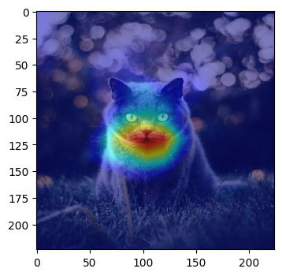
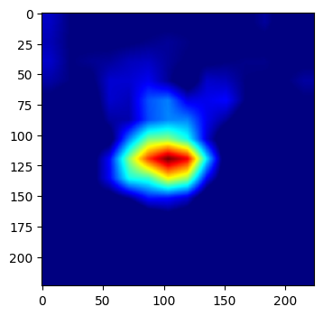

## VizGradCAM
VizGradCam is the fastest way to visualize GradCAM in Keras models. GradCAM helps with providing visual explainability of trained models and may serve as an important step in ensuring that engineers observe the regions that contributed to certain inference results.

<p align="center">
  
</p>

Most tutorials or function features similar methods but requires the name of the last convolutional layer, performing the upscaling of heatmap and superimposing it on the original image. In this repository, we aim to combine all of those tasks.
### Usage
This function can be imported or simply copied out into your script where required. Specific usage can be found in the sample [Jupyter Notebook](https://github.com/gkeechin/vizgradcam/blob/main/examples/example.ipynb).

```python
"""
Function Parameters:
    model        : Compiled Model with Weights Loaded
    image        : Image to Perform Inference On 
    plot_results : True - Function Plots using PLT
                   False - Returns Heatmap Array
    interpolant  : Interpolant Value that Describes The Superimposition Ratio
                   Between Image and Heatmap
"""
VizGradCAM(model, image, plot_results=True, interpolant=0.5)
```

__Sample Usage__
```python
# Import Function
from gradcam import VizGradCAM

# Load Your Favourite Image
test_img = img_to_array(load_img("monkey.jpeg" , target_size=(224,224)))

# Use The Function - Boom!
VizGradCAM(EfficientNetB4(weights="imagenet"), test_img))
```

**Results**
`plot_results=True` | `plot_results=False`
------------ | -------------
 | 

### More Information
This function is inspired by Keras' GradCAM tuturial [here](https://keras.io/examples/vision/grad_cam/) and the original paper, _Grad-CAM: Visual Explanations from Deep Networks via Gradient-based Localization_ can be found [here](https://arxiv.org/abs/1610.02391).


### Tested / Supported Models
This function works with Keras CNN models and most Keras Applications / Based Models. This means that it will work even if you used `include_top=False` to add your own final dense layers for transfer learning on some of the models listed below. In GradCAM, we are looking to target gradients flowing into the last convolutional layer.

| Model Architecture |  Support  |  Dimension  |
|--------------------|:---------:|------------:|
VGG16	| ✓	| (224,224)
VGG19	| ✓	| (224,224)
DenseNet121	| ✓	| (224,224)
DenseNet169	| ✓	| (224,224)
ResNet50	| ✓	| (224,224)
ResNet101	| ✓	| (224,224)
ResNet152	| ✓	| (224,224)
ResNet50V2	| ✓	| (224,224)
ResNet101V2	| ✓	| (224,224)
ResNet152V2	| ✓	| (224,224)
MobileNet	| ✓	| (224,224)
MobileNetV2	| ✓	| (224,224)
Xception	| ✓	| (299,299)
InceptionV3	| ✓	| (299,299)
InceptionResNetV2	| ✓	| (299,299)
EfficientNetB0	| ✓	| (224,224)
EfficientNetB1	| ✓	| (240,240)
EfficientNetB2	| ✓	| (260,260)
EfficientNetB3	| ✓	| (300,300)
EfficientNetB4	| ✓	| (380,380)
EfficientNetB5	| ✓	| (456,456)
EfficientNetB6	| ✓	| (528,528)
EfficientNetB7	| ✓	| (600,600)
